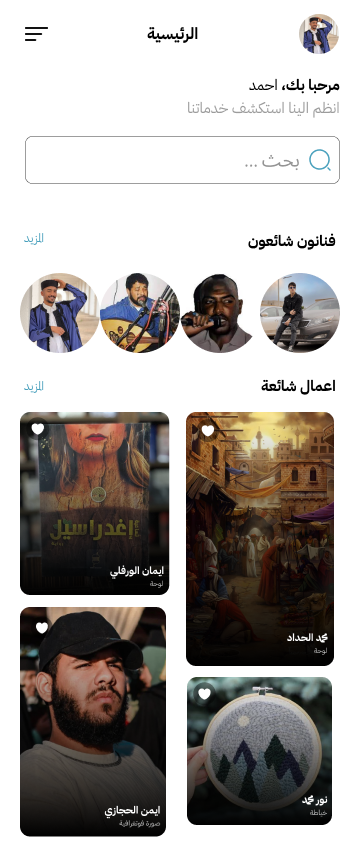
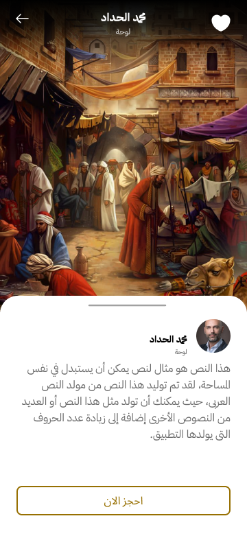

# shaghaf

)

# Shaghaf Official Mobile App
> An app for all artists and art enthusiasts.


## Table of Contents

1. [Features](#features)
	1. [Home](#home)
	1. [Purchasing Products](#Purchasing_Products)
	1. [Asking for Services](#Asking_for_Services)
	1. [Posting art-work](#Posting_art-work)
	1. [Profile](#Profile)
1. [Get the app](#get_the_app)
1. [Installation](#installation)
1. [Data sources](#Data-sources)
1. [Contacts](#contacts)

## Features

This app is split into Five distinct sections. In the future, additional sections might be added as we improve our infrastructure.

<table>
  <tr>
    <td></td>
    <td valign="top">
      <h3>Home</h3>
      <p>Provides a screen with the common artists and common art-work.</p>
    </td>
  </tr>
  <tr>
    <td></td>
    <td valign="top">
      <h3>Purchasing Products</h3>
      <p>Allows users to purchase art equipment.</p>
    </td>
  </tr>
  <tr>
    <td></td>
    <td valign="top">
      <h3>Asking for Services</h3>
      <p>Get to find out how to contact artists for further deals</p>
    </td>
  </tr>
  <tr>
    <td></td>
    <td valign="top">
      <h3>Posting art-work</h3>
      <p>Provides a platform to share art-work with the community.</p>
    </td>
  </tr>
  <tr>
    <td></td>
    <td valign="top">
      <h3>Profile</h3>
      <p>Allows users to have profiles to market their work as artists.</p>
    </td>
  </tr>
 
</table>


## Get the app

Android apk : 

## Installation

Clone this repo to your computer:

```bash
git clone [https://github.com/art-institute-of-chicago/aic-mobile-ios.git](https://github.com/badriyahaddad/shaghaf_.git)
```
## Data sources

Firebase : Firestore, Authentication, storage

## Contacts
Benghazi Camp

Taha Tarbah : Tahatarbah@gmail.com

Badriya Haddad : Badriya.al.haddad.it.3915@gmail.com

